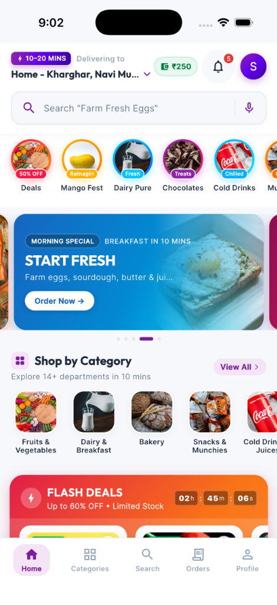
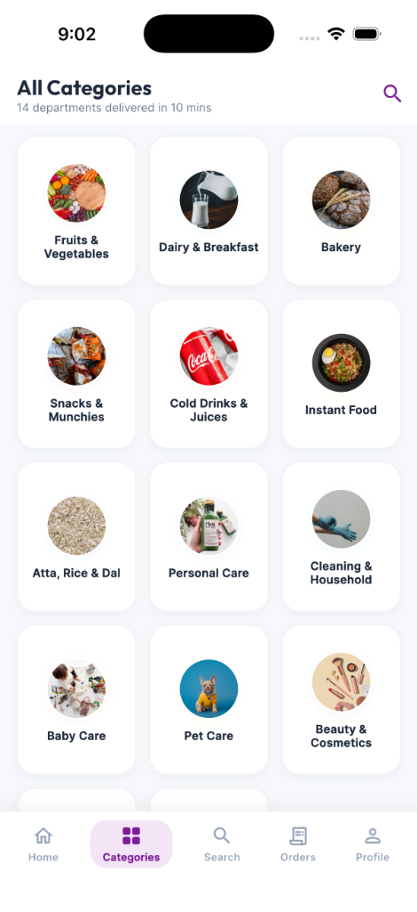
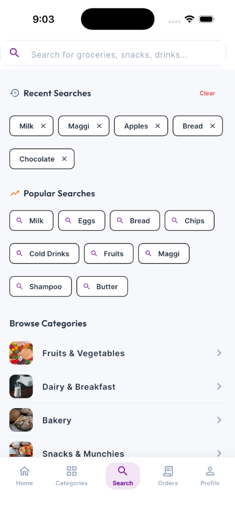
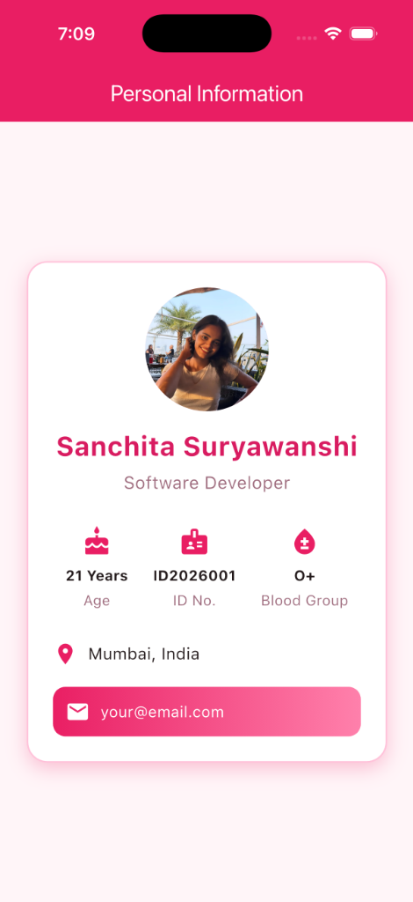

# ⚡ BLINKCART

> **"Everything you need. Delivered in minutes."**

A complete, production-grade quick-commerce e-commerce Flutter application inspired by the lightning-fast user experience of modern 10–20 minute grocery delivery apps. Built with **100% original branding**, original vector artwork, smooth animations, and clean architecture.

---

## 📸 App Screenshots

| 🏠 Home Screen | 🗂️ Categories | 🔍 Search & Explore | 👤 Profile |
| :---: | :---: | :---: | :---: |
|  |  |  |  |

---

## 📱 App Highlights & Features

### 1. ⚡ Ultra-Fast Quick-Commerce Experience
* **10–20 Minute Delivery Guarantee**: Dynamic delivery countdown badges on products, cart, and checkout.
* **Smart Floating Cart Bar**: Slide-up persistent cart summary with item count, total price, total savings badge, and one-tap checkout navigation.
* **Seamless Stepper Animations**: `ADD` button instantly transforms into an interactive `[ - 1 + ]` stepper with haptic feedback.

### 2. 🏪 Rich 40+ Product Catalog across 14 Departments
* **14 Department Categories**:
  1. 🍎 Fruits & Vegetables
  2. 🥛 Dairy, Bread & Eggs
  3. 🍪 Munchies & Snacks
  4. 🥤 Cold Drinks & Juices
  5. 🌾 Atta, Rice, Oil & Dals
  6. 🍳 Breakfast & Instant Food
  7. 🍫 Sweet Tooth & Chocolates
  8. ☕ Tea, Coffee & Health Drinks
  9. 🧼 Cleaning & Household
  10. 🧴 Personal Care & Hygiene
  11. 👶 Baby Care
  12. 🐾 Pet Supplies
  13. 🥩 Meat, Fish & Eggs
  14. 💊 Pharmacy & Wellness
* **Detailed Product Modals**: MRP strike-throughs, percentage discounts, unit details, customer ratings & review counts, key product highlights, and detailed manufacturer/origin specifications.
* **Procedural Artwork System**: Zero broken image URLs. Generates beautiful gradient and emoji-based vector artwork offline for all 40+ products.

### 3. 🔍 Smart Search & Real-Time Filters
* Real-time multi-attribute search across product names, categories, brands, tags, and highlights.
* Search suggestions, trending keyword pills, and persistent recent searches stored in `SharedPreferences`.
* Filter & Sort bottom sheet by Popularity, Price (Low to High / High to Low), Discount %, Rating, and In-Stock status.

### 4. 🛒 Complete Cart & Savings Engine
* Live calculation of Subtotal, Item-level Discounts, Delivery Fee (FREE above ₹199), and Handling Fee (₹5).
* Interactive Delivery Partner Tip selector (₹10, ₹20, ₹30, ₹50, Custom).
* Interactive Coupon System with promo code auto-validation (`FIRST100`, `SAVE50`, `QUICK20`, `WEEKEND`).
* Animated free delivery progress bar showing exact remaining amount needed for free delivery.

### 5. 📍 Location & Address Management
* Location bar showing active delivery address and estimated delivery time.
* Saved Address Management (Home, Work, Other) with default address tagging and full CRUD operations.
* Simulated GPS auto-detection with pre-configured Kharghar/Navi Mumbai and Mumbai presets.

### 6. 💳 Checkout & Multi-Mode Payment
* One-click checkout with saved address confirmation and delivery instructions (e.g., "Leave at door", "Do not ring bell").
* Payment modes: UPI (Google Pay, PhonePe, Paytm, Any UPI ID), Credit/Debit Cards, Net Banking, and Cash on Delivery.
* Animated order processing state with safety checks.

### 7. 🛵 Live Order Tracking Simulation
* Real-time order progress timeline:
  1. *Order Confirmed*
  2. *Items Packed at Dark Store*
  3. *Out for Delivery with Delivery Partner*
  4. *Arrived at Doorstep*
* Delivery partner profile card with calling/messaging simulation.
* Delivery OTP verification code card.
* Order history screen with one-tap "Reorder" capability.

### 8. ❤️ Wishlist & Notifications
* Dedicated wishlist with one-tap "Add All to Cart" action.
* In-app notification center for order updates, discount drops, and flash sales.

---

## 🎨 Visual Design & Theme System

| Element | Specification |
| :--- | :--- |
| **Primary Color** | `#7C1C9C` (Deep Royal Purple) |
| **Primary Light** | `#9C27B0` (Vibrant Purple) |
| **Primary Dark** | `#4A0E4E` (Midnight Plum) |
| **Secondary / Success**| `#00A859` (Fresh Emerald Green) |
| **Accent / Lightning** | `#FF6D00` (Energetic Amber / Orange) |
| **Background** | `#F8F9FD` (Clean Soft Off-White) |
| **Surface** | `#FFFFFF` (Pure White Cards with Soft Elevation) |
| **Typography** | `Outfit` (Display & Headings) + `Inter` (Body & Prices) |

---

## 🏗️ Architecture & State Management

The application follows clean architecture principles with distinct separation of concerns:

```
lib/
├── core/
│   ├── constants/       # AppColors, AppTypography, AppStrings, AppDimensions
│   ├── routes/          # AppRoutes named route table
│   ├── theme/           # Material 3 ThemeData with custom ColorSchemes
│   ├── utils/           # Formatters (INR Currency ₹, Dates), ToastUtils
│   └── widgets/         # CustomButton, CustomTextField, EmptyStateView,
│                        # ShimmerLoading, RatingBadge, DeliveryBadge, ProductArtwork
├── models/              # Product, Category, CartItem, Address, Order, Coupon, Notification
├── data/                # Mock catalog: 14 categories, 40+ products, banners, coupons
├── providers/           # CartProvider, ProductProvider, WishlistProvider,
│                        # AddressProvider, OrderProvider, LocationProvider, CouponProvider
├── widgets/             # ProductCard, QuantitySelector, FloatingCartBar, CustomBottomNavBar
├── screens/
│   ├── splash/          # Animated branded splash screen with auto-routing
│   ├── onboarding/      # 3-step value proposition onboarding flow
│   ├── location/        # Location picker and address detector
│   ├── main_shell/      # 5-tab persistent bottom navigation shell
│   ├── home/            # Header, Banner Carousel, Categories, Flash Deals, Bestsellers
│   ├── category/        # Department browser and filtered category product lists
│   ├── search/          # Search bar, recent searches, real-time results
│   ├── product/         # Full product detail screen with specs & related items
│   ├── cart/            # Itemized cart, coupon bottom sheet, bill breakdown, tips
│   ├── address/         # Saved addresses list and Add/Edit address forms
│   ├── checkout/        # Order review and delivery instructions
│   ├── checkout/payment # Multi-method payment screen with processing animation
│   ├── order/           # Order Success, Live Tracking, Order History & Order Details
│   ├── wishlist/        # Saved products grid with "Add All to Cart"
│   ├── offers/          # Deals of the Day and copyable coupon vouchers
│   ├── profile/         # User profile, wallet, saved addresses, FAQs, dark mode toggle
│   └── notifications/   # In-app notifications feed
├── app.dart             # MultiProvider configuration and MaterialApp
└── main.dart            # Flutter application entry point
```

---

## 🚀 Getting Started & How to Run

### Prerequisites
* Flutter SDK (3.22.0+ or compatible)
* Dart SDK (3.4.0+)
* Android Studio / Xcode / VS Code with Flutter extension
* Chrome / macOS / iOS Simulator / Android Emulator

### Installation Steps

1. **Clone or Open the Repository:**
   ```bash
   cd ecommerce
   ```

2. **Install Dependencies:**
   ```bash
   flutter pub get
   ```

3. **Verify Code Quality:**
   ```bash
   flutter analyze
   ```
   *(Expected result: No issues found!)*

4. **Run the Test Suite:**
   ```bash
   flutter test
   ```
   *(Expected result: All 15 unit & widget tests pass cleanly!)*

5. **Run the Application:**
   ```bash
   # Run on connected device / emulator:
   flutter run

   # Or run on Chrome:
   flutter run -d chrome

   # Or run on macOS desktop:
   flutter run -d macos
   ```

---

## 🧪 Test Suite Coverage

The project includes thorough unit and widget tests:
* **`test/models/product_test.dart`**: Validates catalog size (40+ items), JSON serialization/deserialization, and discount/savings calculations.
* **`test/providers/product_provider_test.dart`**: Tests category filtering, multi-keyword search, and sort order.
* **`test/providers/cart_provider_test.dart`**: Tests cart math (subtotal, delivery fee waiver threshold, handling fee, tips), quantity adjustments, item removal, and coupon discount application.
* **`test/widget_test.dart`**: Tests component rendering and interactions for `RatingBadge`, `DeliveryBadge`, `EmptyStateView`, `QuantitySelector` (stepper transitions), and `ProductCard`.

---

## 📄 License

This project is built for demonstration purposes. 100% original branding, copy, and procedural artwork assets.
